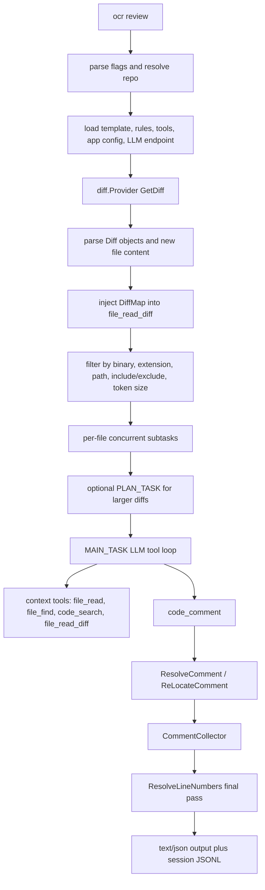

# OpenCodeReview 工程结构与设计速读

> 分析基线：`origin/main` 最新提交 `48cc6a3`，分支 `feature/open-code-review-analysis`，日期 2026-06-09。

## 1. 项目定位

OpenCodeReview 是一个面向 Git 变更的 AI Code Review CLI。它的核心不是简单把 diff 丢给模型，而是把确定性工程逻辑和 LLM agent 组合起来：

- 确定性部分负责：Git diff 获取、文件过滤、规则匹配、任务拆分、并发控制、工具定义、评论行号定位、输出格式和会话记录。
- LLM 部分负责：基于模板审查单个文件、按需调用上下文工具、生成结构化 `code_comment`。
- CLI 之外还提供：npm 安装包装、Claude/Codex skill/plugin、GitHub Actions 示例、会话 Web viewer、GitHub Pages 落地页。

快速理解这个项目时，优先把它看成一个 Go CLI 工程；`pages/` 是官网前端，`package.json` 和 `bin/ocr.js` 是 npm 分发壳。

## 2. 技术栈与规模

| 维度 | 内容 |
| --- | --- |
| 主语言 | Go 1.25 |
| CLI 入口 | `cmd/opencodereview` |
| 核心包 | `internal/agent`, `internal/diff`, `internal/tool`, `internal/llm`, `internal/config` |
| LLM SDK | Anthropic SDK, OpenAI Go SDK |
| Token 估算 | `tiktoken-go`，BPE 数据内嵌 |
| 观测 | OpenTelemetry，可 console 或 OTLP |
| 前端 | React 18 + TypeScript + Webpack + Tailwind |
| npm 分发 | `@alibaba-group/open-code-review`，postinstall 下载 release binary |
| 当前规模 | 170 个 git 跟踪文件，其中 Go 源码/测试 70 个，Go 总行数约 13.5k |

## 3. 顶层目录

| 路径 | 作用 | 建议阅读优先级 |
| --- | --- | --- |
| `cmd/opencodereview/` | 主 CLI：命令分发、review/config/llm/rules/viewer 子命令、输出渲染 | 最高 |
| `internal/agent/` | 审查编排器：加载 diff、过滤、按文件并发、plan/main LLM 循环、工具调用、上下文压缩 | 最高 |
| `internal/diff/` | Git diff provider、diff 解析、hunk 解析、评论行号定位、失败时 LLM 重定位 | 最高 |
| `internal/tool/` | 给模型用的工具实现：读文件、找文件、搜索代码、读其他 diff、收集评论 | 高 |
| `internal/llm/` | LLM 抽象、OpenAI/Anthropic 适配、配置解析、token 统计 | 高 |
| `internal/config/` | 内置 prompt 模板、规则、工具定义、allowlist、连通性测试任务 | 高 |
| `internal/session/` | 审查会话 JSONL 记录，供 viewer 浏览 | 中 |
| `internal/viewer/` | 本地 WebUI 浏览历史会话，含 Host 防护 | 中 |
| `internal/telemetry/` | OTel tracing/metrics 和控制台进度输出 | 中 |
| `internal/gitcmd/` | Git 子进程并发限制 | 中 |
| `internal/model/` | Diff 和 review comment 数据结构 | 中 |
| `bin/`, `scripts/`, `package.json` | npm 安装、自动更新、二进制包装 | 中 |
| `pages/` | 官网页面，不参与 CLI 审查主链路 | 低 |
| `skills/`, `plugins/` | Claude/Codex 集成说明 | 低 |
| `.github/workflows/` | release、pages、PR 自动 review 示例 | 低 |

## 4. 一句话架构

`ocr review` 是一个“每个文件一个 agent 子任务”的 pipeline：先确定要审哪些文件，再为每个文件准备 prompt、规则和工具，LLM 通过工具补上下文并用 `code_comment` 产出评论，最后工程代码把评论定位到真实 diff 行号并统一输出。



## 5. CLI 命令层

入口文件是 `cmd/opencodereview/main.go`。`main()` 做三件事：

1. 设置 LLM 包全局版本号并初始化内嵌 BPE loader。
2. 初始化 telemetry。
3. 调用 `dispatch()` 按第一个参数分发到子命令。

当前顶层命令：

- `review` / `r`：执行代码审查。
- `config`：写入 `~/.opencodereview/config.json`。
- `llm test`：验证 LLM 配置可用。
- `rules check`：展示某个文件命中的 review rule。
- `viewer`：启动本地会话浏览器。
- `version`：输出版本信息。

`cmd/opencodereview/flags.go` 里自定义了 `ocrFlagSet`，主要是补 Go 标准 `flag` 缺失的短参数映射，例如 `-c` 展开为 `--commit`、`-f` 展开为 `--format`。review 支持三种模式：

| 模式 | 触发方式 | 含义 |
| --- | --- | --- |
| workspace | 不传 `--from/--to/--commit` | 审查 staged、unstaged、untracked |
| range | `--from <base> --to <head>` | 用 merge-base 到 head 的 diff |
| commit | `--commit <sha>` | 审查单个 commit 相对父提交的变更 |

## 6. `runReview` 装配流程

`cmd/opencodereview/review_cmd.go` 是主装配点，顺序很重要：

1. 解析 review 参数并确认仓库有效。
2. 加载内置 prompt 模板 `internal/config/template/task_template.json`。
3. 加载规则解析器 `rules.NewResolver(repoDir, opts.rulePath)`。
4. 如果是 `--preview`，只跑 diff 和过滤预览，不调用 LLM。
5. 加载工具定义 `internal/config/toolsconfig/tools.json`，拆成 plan 阶段和 main 阶段两套 tool defs。
6. 读取用户配置 `~/.opencodereview/config.json`，并把 `language` 注入所有 system prompt。
7. 解析 LLM endpoint，创建 OpenAI 或 Anthropic client。
8. 创建全局 Git runner，用 `--max-git-procs` 控制 Git 子进程并发。
9. 创建 `CommentCollector` 和 `FileReader`，注册工具。
10. 构造 `agent.Agent` 并执行。
11. 用 `diff.ResolveLineNumbers` 再做一次最终行号补齐。
12. 按 `--format text/json` 和 `--audience human/agent` 输出。

这层本身不写审查逻辑，主要负责依赖注入和输出。

## 7. Agent 核心设计

核心文件是 `internal/agent/agent.go`，也是当前最大文件。可以按这些概念读：

| 概念 | 说明 |
| --- | --- |
| `Args` | Agent 的全部依赖：repo、diff refs、模板、规则、LLM client、工具、collector、并发参数、session 等 |
| `Agent.Run` | 总入口：加载 diff、注入 DiffMap、过滤文件、并发 dispatch |
| `dispatchSubtasks` | 按文件并发执行，每个文件有独立 timeout |
| `executeSubtask` | 单文件审查：可选 plan 阶段，然后 main LLM 工具循环 |
| `performLlmCodeReview` | 多轮工具调用循环，直到模型调用 `task_done` 或达到工具轮数限制 |
| `executeToolCall` | 执行模型工具调用；`code_comment` 有特殊处理 |
| `addNextMessage` | 把 assistant/tool result 加回上下文，并按 token 阈值触发压缩 |

### 7.1 文件级并发

`--concurrency` 默认 8。Agent 在 `dispatchSubtasks` 中用 semaphore 控制同时审查的文件数。每个文件单独用 `context.WithTimeout` 控制，默认 timeout 是 10 分钟。

注意还有另一层并发控制：`internal/gitcmd.Runner` 用 semaphore 限制所有 Git 子进程总数，默认 16，防止工具并发读文件/搜索时把系统打满。

### 7.2 Plan 阶段

模板里配置了 `PLAN_TASK` 和 `PLAN_MODE_LINE_THRESHOLD`。当前阈值是 50 行：

- 小于阈值：跳过 plan，减少延迟。
- 大于等于阈值：先让模型生成结构化审查计划，计划结果注入 main prompt 的 `{{plan_guidance}}`。

如果 plan 失败，Agent 会记录 warning 并继续 main 阶段，不会让整个文件失败。

### 7.3 Main 工具循环

Main 阶段每轮向 LLM 发送：

- 当前文件 diff。
- 其他变更文件列表。
- 命中的 review checklist/rule。
- 可选 requirement background。
- 可选 plan guidance。
- main 阶段可用工具定义。

模型必须调用工具：

- 没有工具调用：Agent 会追加提示让模型重试或 `task_done`。
- `task_done`：该文件审查结束。
- `code_comment`：表示发现问题。
- 其他工具：返回上下文信息，再进入下一轮。

`MAX_TOOL_REQUEST_TIMES` 当前为 30。连续 3 轮没有有效工具结果会停止该文件。

### 7.4 上下文压缩

Agent 用本地 token 估算控制上下文：

- 60% `MAX_TOKENS`：异步触发 memory compression。
- 80% `MAX_TOKENS`：同步压缩。

压缩策略是三段式：

- frozen zone：保留最初 system/user 两条消息。
- compress zone：把较早轮次压缩成摘要。
- active zone：保留最近完整 assistant + tool result 轮次。

压缩摘要会写回用户消息的 `<previous_review_summary>` 中。

## 8. Diff 与定位系统

核心文件：

- `internal/diff/git.go`
- `internal/diff/parser.go`
- `internal/diff/hunk.go`
- `internal/diff/resolver.go`
- `internal/diff/relocation.go`

### 8.1 Diff 获取

`diff.Provider` 有三种模式：

| Provider | Git 命令逻辑 |
| --- | --- |
| workspace | `git diff HEAD`，再补 untracked 文件为 synthetic diff |
| range | `git merge-base from to` 后 `git diff base to` |
| commit | `git show commit` |

获取后统一进入 `ParseDiffText`，解析为 `model.Diff`：

```go
type Diff struct {
  OldPath, NewPath string
  Diff string
  NewFileContent string
  IsBinary, IsDeleted, IsNew bool
  Insertions, Deletions int64
}
```

workspace 模式读磁盘里的新文件内容；range/commit 模式用 `git show <ref>:<path>` 读目标 ref 下的文件内容。

### 8.2 文件过滤

过滤发生在两层：

1. `diff.Provider.filterDiffs`：排除 `.git/`, `node_modules/`, `vendor/`, `target/` 等目录，并尊重 `.gitignore`。
2. `agent.whyExcluded`：排除 binary、unsupported extension、默认测试路径、用户 include/exclude。

默认可审文件后缀在 `internal/config/allowlist/supported_file_types.json`，默认排除测试路径在 `default_exclude_patterns.json`。

### 8.3 评论行号定位

模型的 `code_comment` 只需要提供 `existing_code`，工程侧负责定位：

1. `ResolveComment` 先解析 diff hunk。
2. 优先在 new-side 的 context+added lines 中匹配。
3. 再在 old-side 的 context+deleted lines 中匹配。
4. 如果 hunk 匹配失败，扫描完整新文件内容。
5. 如果仍失败且模板配置了 `RE_LOCATION_TASK`，再让 LLM 从 diff 和评论中抽取最小相关代码片段，然后重试定位。

这就是项目强调“避免 position drift”的主要工程约束。

## 9. Tool 系统

工具接口在 `internal/tool/definitions.go`：

```go
type Provider interface {
  Tool() Tool
  Execute(ctx context.Context, args map[string]any) (string, error)
}
```

启动时 `runReview` 注册工具实现，Agent 再从 `tools.json` 生成给模型看的 function definitions。工具实际可用性和模型可见性是分开的：

- Go registry 决定工具能不能执行。
- `tools.json` 决定某阶段是否暴露给模型。

当前工具：

| 工具 | 阶段 | 实现 | 作用 |
| --- | --- | --- | --- |
| `task_done` | main | Agent 内置特殊处理 | 结束单文件审查 |
| `code_comment` | main | Agent 特殊处理 + `tool.ParseComments` | 提交 review comment |
| `file_read` | main | `internal/tool/file_read.go` | 读当前版本文件内容，最多 500 行 |
| `code_search` | plan/main | `internal/tool/code_search.go` | 用 `git grep` 搜索 |
| `file_read_diff` | plan/main | `internal/tool/file_read_diff.go` | 读取其他变更文件的 diff |
| `file_find` | plan/main | `internal/tool/file_find.go` | 用 Git 文件列表按文件名查找 |

`code_comment` 没有走普通 provider 执行路径，而是在 `agent.executeToolCall` 中特判。这样可以在加入 collector 前做行号解析、必要时重定位、异步 comment worker 处理和 session 记录。

## 10. LLM 抽象与配置优先级

核心文件：

- `internal/llm/client.go`
- `internal/llm/resolver.go`
- `cmd/opencodereview/config_cmd.go`

`llm.LLMClient` 只有一个方法：

```go
CompletionsWithCtx(ctx context.Context, req ChatRequest) (*ChatResponse, error)
```

`ChatRequest` 和 `ChatResponse` 是项目内部统一格式。OpenAI 和 Anthropic 适配器负责：

- system/user/assistant/tool message 转换。
- tool definition 转换。
- tool call 结果映射。
- usage/token 字段提取。
- 供应商特有 `extra_body` 注入。

LLM endpoint 解析优先级：

1. OCR 配置文件：`~/.opencodereview/config.json`
2. OCR 环境变量：`OCR_LLM_URL`, `OCR_LLM_TOKEN`, `OCR_LLM_MODEL`, `OCR_USE_ANTHROPIC`, `OCR_LLM_AUTH_HEADER`
3. Claude Code 环境变量：`ANTHROPIC_BASE_URL`, `ANTHROPIC_AUTH_TOKEN`, `ANTHROPIC_MODEL`
4. shell rc：`~/.zshrc`, `~/.bashrc`, `~/.bash_profile`, `~/.profile` 中的 `ANTHROPIC_*`

Anthropic 默认 auth header 是 `authorization`，也支持 `x-api-key`；OpenAI-compatible 走 OpenAI SDK 的 API key 机制。

## 11. Prompt、规则与 allowlist

### 11.1 Prompt 模板

`internal/config/template/task_template.json` 包含：

- `MAIN_TASK`
- `PLAN_TASK`
- `MEMORY_COMPRESSION_TASK`
- `RE_LOCATION_TASK`
- token 和工具轮数阈值

模板中的占位符由 Agent 运行时替换：

- `{{current_file_path}}`
- `{{diff}}`
- `{{change_files}}`
- `{{system_rule}}`
- `{{requirement_background}}`
- `{{plan_guidance}}`
- `{{current_system_date_time}}`

用户配置里的 `language` 会追加到所有 system prompt：`Always respond in <language>.`

### 11.2 Review Rule

规则解析器在 `internal/config/rules/system_rules.go`。规则优先级：

1. `--rule <path>` 指定的自定义规则文件。
2. 仓库内 `.opencodereview/rule.json`。
3. 用户全局 `~/.opencodereview/rule.json`。
4. 内置 `system_rules.json` 和 `rule_docs/*.md`。

内置规则按路径 glob 命中，例如：

- `**/*.properties`
- `**/pom.xml`
- `**/package.json`
- `**/Cargo.toml`
- `**/*.{ts,js,tsx,jsx}`
- `**/*.rs`

路径匹配用 `doublestar`，支持 `**` 和 `{a,b}`，并且 first match wins。

### 11.3 用户 include/exclude

`.opencodereview/rule.json` 还可以配置 `include` / `exclude`。注意过滤规则的合并策略不是逐层叠加，而是“取最高优先级且配置了 include/exclude 的那一层”：

`custom > project > global`

这和 review rule 的逐层 fallback 不一样。

## 12. 输出、会话与 Viewer

### 12.1 输出格式

`cmd/opencodereview/output.go` 支持：

- 文本输出：按评论渲染位置、说明、建议 diff。
- JSON 输出：`status`, `message`, `summary`, `comments`, `warnings`。
- agent audience：执行时静默进度，最后恢复 summary，便于被其他 agent 调用。

如果没有可审文件，JSON 会返回：

```json
{
  "status": "skipped",
  "message": "No supported files changed.",
  "comments": []
}
```

### 12.2 Session JSONL

`internal/session` 会把每次 review 记录写到：

`~/.opencodereview/sessions/<encoded-repo-path>/<session-id>.jsonl`

记录类型包括：

- `session_start`
- `llm_request`
- `llm_response`
- `llm_error`
- `tool_call`
- `session_end`

这对调试模型行为很关键，可以还原每个文件的 prompt、响应、工具调用、token usage、错误。

### 12.3 Viewer

`ocr viewer` 默认监听 `localhost:5483`，读取 session JSONL 并渲染本地 HTML。`internal/viewer/hostguard.go` 做了 Host header allowlist：

- 默认允许 loopback。
- 如果绑定具体 IP，也允许这个 bind host。
- 如果绑定 `0.0.0.0` 或 `:`，不会自动允许公网 Host，需要 `OCR_VIEWER_ALLOWED_HOSTS` 显式配置。

这是为了避免本地 viewer 暴露源码和 LLM 对话时被 DNS rebinding 读取。

## 13. 发布、安装与集成

### 13.1 Go release

`Makefile` 支持：

- `make build`
- `make test`
- `make dist`
- `make build-all`
- `make sha256sum`

`.github/workflows/release.yml` 在 tag `v*` 推送时：

1. 构建 Linux/macOS/Windows 的 amd64/arm64 二进制。
2. 生成 `sha256sum.txt`。
3. 创建 GitHub Release。
4. 从 tag 注入 npm package version 并发布 npm。

### 13.2 npm 包装

根 `package.json` 定义 npm 包和 bin：

- 包名：`@alibaba-group/open-code-review`
- 命令：`ocr -> bin/ocr.js`
- postinstall：`scripts/install.js`

`scripts/install.js` 根据平台下载 release binary，并校验 checksum。`bin/ocr.js` 每次运行前会按冷却时间后台触发 `scripts/update.js` 检查 npm latest，并替换本地二进制。

### 13.3 Agent 集成

仓库同时提供：

- `skills/open-code-review/SKILL.md`
- `plugins/open-code-review/skills/open-code-review/SKILL.md`
- `plugins/open-code-review/commands/review.md`

这些文件把 `ocr review --audience agent` 包成 Claude/Codex 可用的 review workflow。

### 13.4 CI 集成

`.github/workflows/ocr-review.yml` 是 PR 自动审查示例，核心方式是：

1. checkout PR head。
2. npm 安装 OCR。
3. 写入 LLM 配置。
4. `ocr review --from origin/<base> --to <head_sha> --format json`。
5. 用 GitHub API 把结果发成 PR review inline comments。

## 14. 官网前端

`pages/` 是独立 React app：

- `pages/src/App.tsx`：路由，`/` 和 `/docs`。
- `pages/src/components/LandingPage.tsx`：组合 hero、highlights、why、features、benchmark、quick start。
- `pages/webpack.config.js`：生产 publicPath 为 `/open-code-review/`。
- `.github/workflows/deploy-pages.yml`：main 分支上 `pages/**` 变化时部署 GitHub Pages。

它和 CLI 核心没有运行时耦合。

## 15. 重要扩展点

### 15.1 新增 review 工具

需要同时改三处：

1. `internal/tool/definitions.go` 增加 `Tool` 名称。
2. 新增 provider，实现 `Tool()` 和 `Execute()`。
3. `cmd/opencodereview/review_cmd.go` 的 `buildToolRegistry` 注册 provider。
4. `internal/config/toolsconfig/tools.json` 增加 tool definition，并决定 `plan_task` / `main_task` 是否暴露。

如果工具会影响评论定位或 collector，参考 `code_comment` 的特殊路径，不要简单走通用 provider。

### 15.2 新增文件类型规则

需要看两类配置：

- 是否允许审查该后缀：`internal/config/allowlist/supported_file_types.json`
- 是否有专门规则：`internal/config/rules/system_rules.json` 和 `rule_docs/<name>.md`

如果是测试文件或生成目录，还要检查 `default_exclude_patterns.json`。

### 15.3 新增 LLM 协议

建议新增实现 `llm.LLMClient`，再改：

- `ResolvedEndpoint.Protocol`
- `ResolveEndpoint` 的协议判定
- `NewLLMClient` factory
- message/tool/usage 映射测试

现有 OpenAI/Anthropic client 的主要复杂点在 tool call 双向映射和 usage 提取。

### 15.4 新增 CLI 输出格式

主要改：

- `reviewOptions.outputFormat` 校验。
- `runReview` 末尾输出分支。
- `cmd/opencodereview/output.go` 增加渲染函数。

需要注意 `--audience agent` 会静默执行期 stdout，避免输出被进度日志污染。

## 16. 当前质量状态

在本 worktree 上执行 `make test`，Go 全量测试当前失败 1 处：

```text
FAIL cmd/opencodereview
TestSetConfigValueAuthHeaderTrimsCustomHeader:
setConfigValue: unsupported auth_header value "X-Custom-Auth"; expected "x-api-key" or "authorization"
```

原因是测试仍期待自定义 auth header 透传，但当前 `llm.NormalizeAuthHeader` 已限制为 `x-api-key` 或 `authorization`。这看起来是测试与新行为不一致，不是本次文档新增导致。

其他已执行到的包测试显示大量通过，包括 allowlist、rules、diff、llm、release、session、tool、viewer 等。

## 17. 快速掌握阅读路线

建议按这个顺序读源码：

1. `README.md`：理解产品目标、安装和用户视角。
2. `cmd/opencodereview/main.go`：看命令分发。
3. `cmd/opencodereview/review_cmd.go`：看 review 的依赖装配。
4. `internal/agent/agent.go`：看核心 pipeline，先只读 `Run`、`dispatchSubtasks`、`executeSubtask`、`performLlmCodeReview`、`executeToolCall`。
5. `internal/config/template/task_template.json`：看模型到底收到什么任务。
6. `internal/config/toolsconfig/tools.json`：看模型能调用什么。
7. `internal/diff/git.go` 和 `internal/diff/resolver.go`：看 diff 获取和行号定位。
8. `internal/config/rules/system_rules.go`：看规则优先级和 path matching。
9. `internal/llm/resolver.go` 和 `internal/llm/client.go`：看配置解析和协议适配。
10. `internal/session`、`internal/viewer`：调试模型行为时再看。

## 18. 常见开发任务入口

| 任务 | 优先看 |
| --- | --- |
| review 漏文件或多审文件 | `internal/diff/git.go`, `internal/agent/preview.go`, `internal/config/allowlist/*`, `internal/config/rules/system_rules.go` |
| 评论行号不准 | `internal/diff/resolver.go`, `internal/diff/hunk.go`, `internal/diff/relocation.go`, `internal/config/template/task_template.json` |
| 模型不会正确调用工具 | `internal/config/toolsconfig/tools.json`, `internal/agent/agent.go`, `internal/llm/client.go` |
| LLM 配置不生效 | `cmd/opencodereview/config_cmd.go`, `internal/llm/resolver.go` |
| JSON 输出被进度污染 | `cmd/opencodereview/review_cmd.go`, `internal/stdout/stdout.go`, `cmd/opencodereview/output.go` |
| 并发或卡顿 | `internal/agent/agent.go`, `internal/gitcmd/runner.go`, tool 文件中的 timeout |
| 规则不匹配 | `cmd/opencodereview/rules_cmd.go`, `internal/config/rules/system_rules.go` |
| viewer 暴露风险 | `internal/viewer/hostguard.go`, `internal/viewer/server.go` |
| npm 安装失败 | `scripts/install.js`, `scripts/update.js`, `.github/workflows/release.yml` |

## 19. 最小本地验证命令

文档或小改动：

```bash
git status --short
```

Go 主体：

```bash
make test
```

如果只验证当前已知失败点：

```bash
go test ./cmd/opencodereview -run TestSetConfigValueAuthHeader -v
```

前端站点：

```bash
cd pages
npm install
npm run typecheck
npm run build
```

CLI 编译：

```bash
make build
./dist/opencodereview version
```

Diff 解析调试：

```bash
go run ./cmd/testdiff -summary
go run ./cmd/testdiff -from main -to HEAD -summary
```

规则命中调试：

```bash
go run ./cmd/opencodereview rules check internal/agent/agent.go
```

## 20. 设计取舍总结

这个项目最核心的设计取舍是：LLM 只做需要语义判断的部分，所有可工程化约束尽量放在 Go 代码里。

优点：

- 文件选择、过滤、并发、行号定位、输出格式稳定可测。
- 大变更可以按文件并发拆分，降低单个上下文失控风险。
- 工具集合受控，比通用 agent 更可预测。
- session JSONL 和 viewer 让模型行为可追踪。

代价：

- `internal/agent/agent.go` 承担了较多职责，后续改动需要小心并发、session、tool loop、compression 的相互影响。
- prompt/template、tools.json、Go registry 三处需要保持一致。
- `code_comment` 是特殊路径，不是普通工具；新增类似能力时需要理解定位和 collector 生命周期。
- 行号定位依赖模型提供可匹配的 `existing_code`，虽然有重定位补救，但仍需要 prompt 和工具定义持续约束模型输出。
